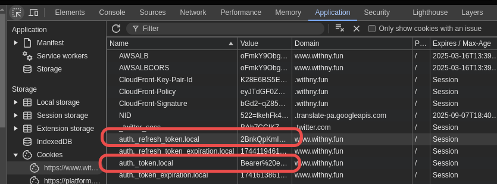
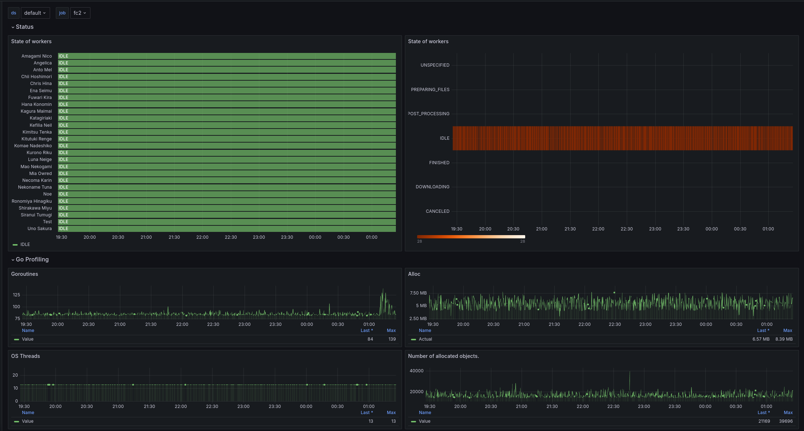

# withny-dl

Automatically download withny livestream. Written in Go.

## Table of Contents

- [withny-dl](#withny-dl)
  - [Table of Contents](#table-of-contents)
  - [Features](#features)
  - [Installation](#installation)
    - [Docker (amd64, arm64) (recommended, ~30 MB)](#docker-amd64-arm64-recommended-30-mb)
    - [Static binaries (amd64, arm64) (~30 MB)](#static-binaries-amd64-arm64-30-mb)
    - [Install from source (~16MB)](#install-from-source-16mb)
    - [Deployments (Kubernetes/Docker-Compose)](#deployments-kubernetesdocker-compose)
  - [Usage](#usage)
  - [Details](#details)
    - [Token-based authentication](#token-based-authentication)
    - [About the concatenation and the cleaning routine](#about-the-concatenation-and-the-cleaning-routine)
    - [About metrics, traces and continuous profiling](#about-metrics-traces-and-continuous-profiling)
      - [Prometheus (Pull-based, metrics only)](#prometheus-pull-based-metrics-only)
      - [OTLP (Push-based)](#otlp-push-based)
      - [Continuous Profiling (pull-based)](#continuous-profiling-pull-based)
      - [Grafana Configuration](#grafana-configuration)
    - [About proxies](#about-proxies)
  - [License](#license)
  - [Credits](#credits)

## Features

- Download withny live streams automatically via polling.
- Save live chat into a JSON file.
- Save stream information into a JSON file.
- Download thumbnails.
- Remux the stream into an MP4 file.
- Extract audio from the stream.
- Concatenate and remux with previous recordings after it is finished (in case of crashes).
- Session auto-refresh.
- No dependencies needed on the host.
- Statically compiled with libav (ffmpeg) rather than running CLI commands on FFmpeg.
- Very low CPU and RAM usage.
- Minor fixes like graceful exit and crash recovery.
- YAML/JSON config file.
- Notification via [shoutrrr](https://github.com/containrrr/shoutrrr) which supports multiple notification services.
- Metrics, Traces and Continuous Profiling support.

## Installation

### Docker (amd64, arm64) (recommended, ~30 MB)

Using Docker or Kubernetes is the recommended way to run the program, and is heavily tested, profiled and provides many advantages like auto-restart, healthcheck, resource limits... It is also the easiest way to run the program.

Pull the container image:

```shell
docker pull ghcr.io/darkness4/withny-dl:latest
```

Usage:

```shell
mkdir -p $(pwd)/out
docker run --restart=unless-stopped \
  -v $(pwd)/out:/out \
  ghcr.io/darkness4/withny-dl:latest [global options] [command] [command options]

# -v: Mount the output directory to /out in the container.
# [...]: See the Usage section.
```

The container is based on `scratch`, which is an empty container image. The container image is created using the [Dockerfile.static-base](Dockerfile.static-base) and [Dockerfile.static](Dockerfile.static) files.

Examples of deployment with Docker-Compose and Kubernetes are available in the [`./deployments`](./deployments) directory.

### Static binaries (amd64, arm64) (~30 MB)

Prebuilt binaries using FFmpeg static libraries are [available](https://github.com/Darkness4/withny-dl/releases/latest) on the GitHub Releases tab.

**Linux**

Static binaries are generated using the [Dockerfile.static-base](https://github.com/Darkness4/fc2-live-dl-go/blob/main/Dockerfile.static-base) and [Dockerfile.static](Dockerfile.static) files.

You can customize FFmpeg by editing [Dockerfile.static-base](https://github.com/Darkness4/fc2-live-dl-go/blob/main/Dockerfile.static-base).

The build system is Portage.

**Darwin**

Partial static binaries are generated using the [Dockerfile.darwin-base](https://github.com/Darkness4/fc2-live-dl-go/blob/main/Dockerfile.darwin-base) and [Dockerfile.darwin](Dockerfile.darwin) files.

You can customize FFmpeg by editing [Dockerfile.darwin-base](https://github.com/Darkness4/fc2-live-dl-go/blob/main/Dockerfile.darwin-base).

Do note that the Darwin binaries are also linked to `libSystem`, which adds a requirement on the OS version.

The requirements are:

- For x86_64, the OS X version must be greater or equal than 10.5.
- For ARM64v8, the OS X version must be greater or equal than 11.0.

The build system is OSXCross.

**Windows**

> [!WARNING]
>
> While static binaries are available, they are not tested. **Using Docker/Podman machine is heavily recommended**.
> You have been warned!

Static binaries are generated using the file [Dockerfile.windows-base](https://github.com/Darkness4/fc2-live-dl-go/blob/main/Dockerfile.static-windows-base) and [Dockerfile.windows](Dockerfile.static-windows).

You can customize FFmpeg by editing [Dockerfile.windows-base](https://github.com/Darkness4/fc2-live-dl-go/blob/main/Dockerfile.static-windows-base).

The build system is MXE.

### Install from source (~16MB)

_Binary size doesn't include ffmpeg linked libraries._

See [BUILD.md](BUILD.md).

### Deployments (Kubernetes/Docker-Compose)

Examples of deployments manifests are stored in the [`./deployments`](./deployments) directory.

## Usage

```shell
withny-dl [global options] watch [command options]
```

```shell
OPTIONS:
   --config value, -c value      Config file path. (required)
   --pprof.listen-address value  The address to listen on for pprof. (default: ":3000") [$PPROF_LISTEN_ADDRESS]
   --traces.export               Enable traces push. (To configure the exporter, set the OTEL_EXPORTER_OTLP_ENDPOINT environment variable, see https://opentelemetry.io/docs/languages/sdk-configuration/otlp-exporter/) (default: false) [$OTEL_EXPORTER_OTLP_TRACES_ENABLED]
   --metrics.export              Enable metrics push. (To configure the exporter, set the OTEL_EXPORTER_OTLP_ENDPOINT environment variable, see https://opentelemetry.io/docs/languages/sdk-configuration/otlp-exporter/). Note that a Prometheus path is already exposed at /metrics. (default: false) [$OTEL_EXPORTER_OTLP_METRICS_ENABLED]

GLOBAL OPTIONS:
   --debug        (default: false) [$DEBUG]
   --trace        (default: false) [$TRACE]
   --log-json     (default: false) [$LOG_JSON]
   --help, -h     show help
   --version, -v  print the version
```

When running the watcher, the program opens the port `3000/tcp` for debugging. You can access the pprof dashboard by accessing at `http://<host>:3000/debug/pprof/` or by using `go tool pprof http://host:port/debug/pprof/profile`.

**A status page is also accessible at `http://<host>:3000/`.**

To configure the watcher, you must provide a configuration file. The configuration file is in YAML format. See the [config.yaml](config.yaml) file for an example.

Minimal configuration:

```yaml
# credentials.yaml
# See below for more details.
token: 'ey...'
refreshToken: 'abc...'
## Login by username and password is obsolete and will no longer be supported
## due to Withny added captcha.
```

```yaml
# config.yaml
credentialsFile: 'credentials.yaml'
## Withny-dl refreshes the token and must store it somewhere.
## The file is encrypted.
cachedCredentialsFile: 'withny-dl.json'
## The cache will be cleared after X failures to login.
## There is a try 60 second.
clearCredentialCacheOnFailureAfter: 10

defaultParams:
  outFormat: output/{{ .ChannelID }}/{{ .Date }} {{ .Title }}.{{ .Ext }}
  remux: false
  concat: true
  scanDirectory: 'output'
  eligibleForCleaningAge: '3h'
  keepIntermediates: false
  deleteCorrupted: true
  extractAudio: true

## A list of channel IDs.
channels:
  # An empty string will download every live channels!
  '':
    # Ignore specific channels.
    ignore:
      - 'admin'

  'admin':
    ## Set the passcode to access channel (optional, default: "").
    passCode: ''
    labels:
      EnglishName: Admin
```

<details>

<summary>Configuration Full</summary>

````yaml
---
## [REQUIRED] Path to the file containing the credentials. (default: '')
##
## Example of content:
##
## ```yaml
## token: "ey..."
## refreshToken: "abc..."
## ```
##
credentialsFile: 'credentials.yaml'
## Withny-dl refreshes the token and must store it somewhere.
## The file is encrypted.
cachedCredentialsFile: 'withny-dl.json'
## The cache will be cleared after X failures to login.
## There is a try 60 second.
clearCredentialCacheOnFailureAfter: 10

defaultParams:
  ## Quality constraint to select the stream to download.
  ##
  ## None means the highest quality available. Constraints are inclusive.
  ## Recommendation is to set nothing.
  quality:
    ## Height is usually: 1080, 720, 480, 360, 160.
    minHeight: 0
    maxHeight: 0
    ## Width is usually: 1920, 1280, 854, 640, 284.
    minWidth: 0
    maxWidth: 0
    ## FrameRate is usually: 60, 30.
    minFrameRate: 0.0
    maxFrameRate: 0.0
    ## Bandwidth is in bits/s.
    minBandwidth: 0
    maxBandwidth: 0
    ## Select audio quality.
    audioOnly: false
  ## Output format. Uses Golang templating format.
  ##
  ## Available fields: ChannelID, ChannelName, Date, Time, Title, Ext, Labels.Key.
  ## Available format options:
  ##   ChannelID: sanitized ID of the broadcast
  ##   ChannelName: sanitized broadcaster's profile name
  ##   Date: local date YYYY-MM-DD
  ##   Time: local time HHMMSS
  ##   Ext: file extension
  ##   Title: sanitized title of the live broadcast
  ##   MetaData (object): the full metadata (see withny/api/objects.go for the available field)
  ##   Labels.Key: custom labels
  ## (default: "{{ .Date }} {{ .Title }} ({{ .ChannelName }}).{{ .Ext }}")
  outFormat: '{{ .ChannelID }} {{ .ChannelName }}/{{ .Date }} {{ .Title }}.{{ .Ext }}'
  ## Allow a maximum of packet loss before aborting stream download. (default: 20)
  packetLossMax: 20
  ## How many times to retry to download a fragment upon an HTTP error before
  ## increasing packetLoss counter. (default: 10)
  fragmentRetries: 10
  ## How many times to retry to download the m3u8 playlist upon an HTTP error.
  ## (default: 10)
  playlistRetries: 10
  ## Save live chat into a json file. (default: false)
  writeChat: false
  ## Dump output MetaData into a json file. (default: false)
  writeMetaDataJson: false
  ## Download thumbnail into a file. (default: false)
  writeThumbnail: false
  ## How many seconds between checks to see if broadcast is live. (default: 60s)
  waitPollInterval: '60s'
  ## Remux recordings into mp4/m4a after it is finished. (default: true)
  remux: true
  ## Remux format (default: mp4)
  remuxFormat: 'mp4'
  ## Concatenate and remux with previous recordings after it is finished. (default: false)
  ##
  ## WARNING: We recommend to DISABLE remux since concat also remux.
  ##
  ## Input files must be named <name>.<n>.<ts/mp4/mkv...>. If n=0, n is optional.
  ## Output will be named: "<name>.combined.<remuxFormat>".
  ##
  ## n is only used to determine the order. If there are missing fragments,
  ## the concatenation will still be executed.
  ##
  ## The extensions do not matter. A name.1.ts and a name.2.mp4 will still be concatenated together.
  ## TS files will be prioritized over anything else.
  ##
  ## If remux is enabled, remux will be executed first, then the concatenation
  ## will be executed.
  ##
  ## If extractAudio is true, the m4a will be concatenated separatly.
  ##
  ## TL;DR: This is to concatenate if there is a crash.
  concat: false
  ## Keep the raw .ts recordings after it has been remuxed. (default: false)
  ##
  ## If this option is set to false and concat is true, before every "waiting
  ## for stream to be online", a scan will be executed to detect *.combined.*
  ## files.
  ## The scan will be done on the directory of `scanDirectory`.
  ## If a non-corrupted .combined. file is detected, it will remove .ts older
  ## than `eligibleForCleaningAge`.
  ## After the cleaning, the .combined files will be renamed without the
  ## ".combined" part (if a file already exists due to remux, it won't be renamed).
  keepIntermediates: false
  ## Directory to be scanned for .ts files to be deleted after concatenation. (default: '')
  ##
  ## Scan is recursive.
  ##
  ## Empty value means no scanning.
  scanDirectory: ''
  ## Minimum age of .combined files to be eligible for cleaning. (default: 48h)
  ##
  ## The minimum should be the expected duration of a stream to avoid any race condition.
  eligibleForCleaningAge: '48h'
  ## Delete corrupted .ts recordings. (default: true)
  deleteCorrupted: true
  ## Set the passcode to access the channels (optional, default: "").
  ## We recommend to set it per-channel though. See channels.<id>.passCode.
  passCode: ''
  ## Generate an audio-only copy of the stream. (default: false)
  extractAudio: true
  ## Map of key/value strings.
  ##
  ## The value of the label can be invoked in the go template by using {{ .Labels.Key }}.
  labels: {}

## A list of channels.
##
## The keys are the channel IDs/handles without the '@'.
channels:
  'admin':
    ## Set the passcode to access channel (optional, default: "").
    passCode: ''
    labels:
      EnglishName: Admin

rateLimitAvoidance:
  ## Spread the watchers over time to avoid rate limiting. (default: 500ms)
  ##
  ## A zero value means all watchers will start at the same time.
  pollingPacing: 500ms

## Notify about the state of the watcher.
##
## See: https://containrrr.dev/shoutrrr/latest
notifier:
  enabled: false
  includeTitleInMessage: false
  ## Disable priorities if the transport does not support one.
  noPriority: false
  urls:
    - 'gotify://gotify.example.com/token'

  ## The notification formats can be customized.
  ## Title are automatically prefixed with "withny-dl: "
  ## If the message is empty, the message will be the title.
  ## Priorities are following those of android:
  ## Minimum: 0
  ## Low: 1-3
  ## Default: 4-7
  ## High: 8-10
  notificationFormats:
    ## ConfigReloaded is sent when the config is reloaded, i.e. the service restarted.
    configReloaded:
      enabled: true
      # title: "config reloaded"
      # message: <empty>
      # priority: 10

    ## LoginFailed happens when the login failed.
    ## Available fields:
    ##   - Error
    loginFailed:
      enabled: true
      # title: "login failed"
      # message: "{{ .Error }}"
      # priority: 10

    ## Panicked is sent when a critical error happens.
    ## When this happens, it is recommended to contact the developer and open an issue.
    ## Available fields:
    ##   - Capture
    panicked:
      enabled: true
      # title: "panicked"
      # message: "{{ .Capture }}"
      # priority: 10

    ## Idle is the initial state.
    ## Available fields:
    ##   - ChannelID
    ##   - Labels
    idle:
      enabled: false
      # title: "watching {{ .ChannelID }}"
      # message: <empty>
      # priority: 0

    ## Preparing files happens when the stream is online, but not downloading.
    ## Available fields:
    ##   - ChannelID
    ##   - MetaData
    ##   - Labels
    preparingFiles:
      enabled: false
      # title: 'preparing files for {{ .ChannelID }}'
      # message: ''
      # priority: 0

    ## Downloading happens when the stream is online and has emitted a video stream.
    ## Available fields:
    ##   - ChannelID
    ##   - MetaData
    ##   - Labels
    downloading:
      enabled: true
      # title: "{{ .ChannelID }} is streaming"
      # message: "{{ .MetaData.Stream.Title }}"
      # priority: 7

    ## Post-processing happens when the stream has finished streaming.
    ## Available fields:
    ##   - ChannelID
    ##   - MetaData
    ##   - Labels
    postProcessing:
      enabled: false
      # title: "post-processing {{ .ChannelID }}"
      # message: "{{ .MetaData.Stream.Title }}"
      # priority: 7

    ## Finished happens when the stream has finished streaming and post-processing is done.
    ## Available fields:
    ##   - ChannelID
    ##   - MetaData
    ##   - Labels
    finished:
      enabled: true
      # title: "{{ .ChannelID }} stream ended"
      # message: "{{ .MetaData.Stream.Title }}"
      # priority: 7

    ## Error happens when something bad happens with the downloading of the stream.
    ## Error like this can be user or developper related.
    ## Available fields:
    ##   - ChannelID
    ##   - Error
    ##   - Labels
    error:
      enabled: true
      # title: 'watcher of {{ .ChannelID }} thrown an error'
      # message: '{{ .Error }}'
      # priority: 10

    ## Canceled happens when a stream download is canceled.
    ## Available fields:
    ##   - ChannelID
    ##   - Labels
    canceled:
      enabled: true
      # title: "stream download of {{ .ChannelID }} canceled"
      # message: <empty>
      # priority: 7

    ## UpdateAvailable happens when a new version is available.
    ## Available fields:
    ##   - Version
    updateAvailable:
      enabled: true
      # title: "update available ({{ .Version }})"
      # message: "A new version ({{ .Version }}) of withny-dl is available. Please update."
      # priority: 7
````

</details>

## Details

The [config.yaml](config.yaml) file already includes a documentation for each field. This section will explain some of the fields in more detail.

### Token-based authentication

Because withny offers SSO, no password can be used to login. Instead, a token must be used. The token can be obtained in your browser by fetching the cookies:

- `auth._refresh_token.local` (A 20-character string)
- `auth._token.local` **without Bearer** (A JWT token, starting with `ey...`)

You can fetch these cookies by opening the [inspector tools](https://developer.chrome.com/docs/devtools/application/cookies) (Application tab):



Now, let's talk about limitations:

- The refresh token can **only** be used once. After that, the API will return an Unauthorized error. This means that the refresh token in the `credentials.yaml` file should be updated the moment you get an unauthorized error.
- Obviously, this is not optimal, so **withny-dl will do it for you and cache it in the directory specified by `cachedCredentialsFile`** file (with the right permissions). The cache is invalidated if the refresh token fails or is used. If it is invalidated, it will fallback to the `credentials.yaml` file. And if this fails too, the program will exit with an error. **The program will not be able to restart itself if the refresh token is invalid.**

Therefore, it is **extremely recommended to setup a notification channel to be notified when the program stops**. You can find availables channel at [shoutrrr](https://containrrr.dev/shoutrrr/v0.8/services/discord/).

### About the concatenation and the cleaning routine

First issue: **When a download is interrupted and is reconnected, two files are created. If the stream is interrupted multiple times, the directory will be badly polluted.**

The solution: To avoid having multiple files, the program will concatenate the files into a single file.

The implementation: After each download, the program will check if there are files that can be concatenated using pattern matching. If there are files that can be concatenated, the program will concatenate them.

Example:

```text
- name.ts
- name.1.ts

After concatenation:

- name.ts
- name.1.ts
- name.combined.mp4
```

The concatenation is done by concatenating packets, which automatically includes a remuxing step (i.e. the container is changing, but the packets aren't touched). The concatenation is controlled using these parameters (with their recommended values):

```yaml
remux: false # No need to remux since the concatenation will do it.
remuxFormat: mp4 # The format of the remuxed file.
concat: true
extractAudio: false # Your preference.
deleteCorrupted: true # Recommended as corrupted files will also be skipped anyway.
```

Second issue: **If the concatenation is done, the raw files are not deleted.** This is because deleting the files too early can lead to missing parts in the combined file. There is also the issue of a race condition: concatenating while downloading is an undefined behavior.

The solution: To avoid having too many files, the program will clean the files after a certain amount of time.

The implementation: Scans will be executed frequently: Before every "waiting for stream to be online" and periodically. If the .combined file is old enough, the program will delete the raw files and rename the .combined file into the final file.

Example:

```text
- name.1.ts
- name.2.ts
- name.combined.mp4 (older than 48h)

After cleaning:

- name.mp4
```

The cleaning is controlled using these parameters (with their recommended values):

```yaml
concat: true
keepIntermediates: false # Clean the raw files after concatenation.
scanDirectory: '/path/to/directory' # Will scan recursively, so beware.
eligibleForCleaningAge: 48h
```

### About metrics, traces and continuous profiling

#### Prometheus (Pull-based, metrics only)

The program exposes metrics on the `/metrics` endpoint. The metrics are in Prometheus format.

#### OTLP (Push-based)

The program can push metrics to an OTLP receiver. The OTLP client is configurable using standard environment variables.

- [OpenTelemetry Protocol Exporter](https://opentelemetry.io/docs/specs/otel/protocol/exporter/)

Example with Grafana Alloy:

```shell
OTEL_EXPORTER_OTLP_TRACES_ENABLED=true
OTEL_EXPORTER_OTLP_ENDPOINT="https://alloy.example.com:4317"
# (Recommended) CA Verification
OTEL_EXPORTER_OTLP_CERTIFICATE="/certs/ca.crt" # Or /etc/ssl/certs/ca-certificates.crt
# (Optional) mTLS
OTEL_EXPORTER_OTLP_CLIENT_KEY="/certs/tls.key"
OTEL_EXPORTER_OTLP_CLIENT_CERTIFICATE="/certs/tls.crt"
```

With the typical Grafana Alloy configuration:

```hcl
otelcol.receiver.otlp "otlp_receiver" {
  grpc {
    tls {
      ca_file = "/etc/alloy/certs/ca.crt"
      cert_file = "/etc/alloy/certs/tls.crt"
      key_file = "/etc/alloy/certs/tls.key"
      # (optional) mTLS
      client_ca_file = "/etc/alloy/certs/ca.crt"
    }
  }
  http {
    tls {
      ca_file = "/etc/alloy/certs/ca.crt"
      cert_file = "/etc/alloy/certs/tls.crt"
      key_file = "/etc/alloy/certs/tls.key"
      # (optional) mTLS
      client_ca_file = "/etc/alloy/certs/ca.crt"
    }
  }

  output {
    metrics = [otelcol.processor.resourcedetection.default.input]
    logs    = [otelcol.processor.resourcedetection.default.input]
    traces  = [otelcol.processor.resourcedetection.default.input]
  }
}

# [...]
# See https://grafana.com/docs/grafana-cloud/monitor-applications/application-observability/setup/collector/grafana-alloy/

# Feel free to export to Grafana Tempo, Mimir, Prometheus, etc.
# See: https://grafana.com/docs/alloy/latest/reference/components/
```

If you are using mTLS, make sure to have the usages of the certificates correctly set up:

- `client auth` for the client certificate.
- `server auth` for the server certificate.

#### Continuous Profiling (pull-based)

The program can be profiled using the `pprof` package. The pprof package is enabled by default and can be accessed at `http://<host>:3000/debug/pprof/`.

In addition to that, `godeltaprof` has been added for Pyroscope.

You can continuously profile the program using Grafana Alloy with the following configuration:

```hcl
pyroscope.write "write_grafana_pyroscope" {
  endpoint {
    url = env("GRAFANA_CLOUD_PYROSCOPE_ENDPOINT")

    basic_auth {
      username = env("GRAFANA_CLOUD_INSTANCE_ID")
      password = env("GRAFANA_CLOUD_API_KEY")
    }
  }
}


pyroscope.scrape "scrape_withny_pprof" {
  targets    = [{"__address__" = "<host>:3000", "service_name" = "withny"}]
  forward_to = [pyroscope.write.write_grafana_pyroscope.receiver]

  profiling_config {
    profile.process_cpu {
      enabled = true
    }

    profile.godeltaprof_memory {
      enabled = true
    }

    profile.memory { // disable memory, use godeltaprof_memory instead
      enabled = false
    }

    profile.godeltaprof_mutex {
      enabled = true
    }

    profile.mutex { // disable mutex, use godeltaprof_mutex instead
      enabled = false
    }

    profile.godeltaprof_block {
      enabled = true
    }

    profile.block { // disable block, use godeltaprof_block instead
      enabled = false
    }

    profile.goroutine {
      enabled = true
    }
  }
}
```

See [Grafana documentation - Set up Go profiling in pull mode](https://grafana.com/docs/pyroscope/latest/configure-client/grafana-agent/go_pull/) for more information.

#### Grafana Configuration

**Continuous Profiling**

Install the Grafana's [`grafana-pyroscope-app` plugin](https://grafana.com/grafana/plugins/grafana-pyroscope-datasource/).

Profiles can be seen in the "Explore" > "Profiles" "Explore profiles" menu.

**Traces**

Grafana natively supports traces. Simply go to "Explore" and select the Traces data source.

**Metrics**



A dashboard is available in the [grafana](grafana) directory. Simply import it in Grafana to see the metrics.

### About proxies

Since we are using `net/http` and `github.com/coder/websocket`, proxies are supported by passing `HTTP_PROXY` and `HTTPS_PROXY` as environment variables. The format should be either a complete URL or a "host[:port]", in which case the "HTTP" scheme is assumed.

## License

This project is under [MIT License](LICENSE).

## Credits

The executable links to libavformat, libavutil and libavcodec, which are licensed under the Lesser GPL v2.1 (LGPLv2.1). The source code for the libavformat, libavutil and libavcodec libraries is available on the [FFmpeg website](https://www.ffmpeg.org/).
